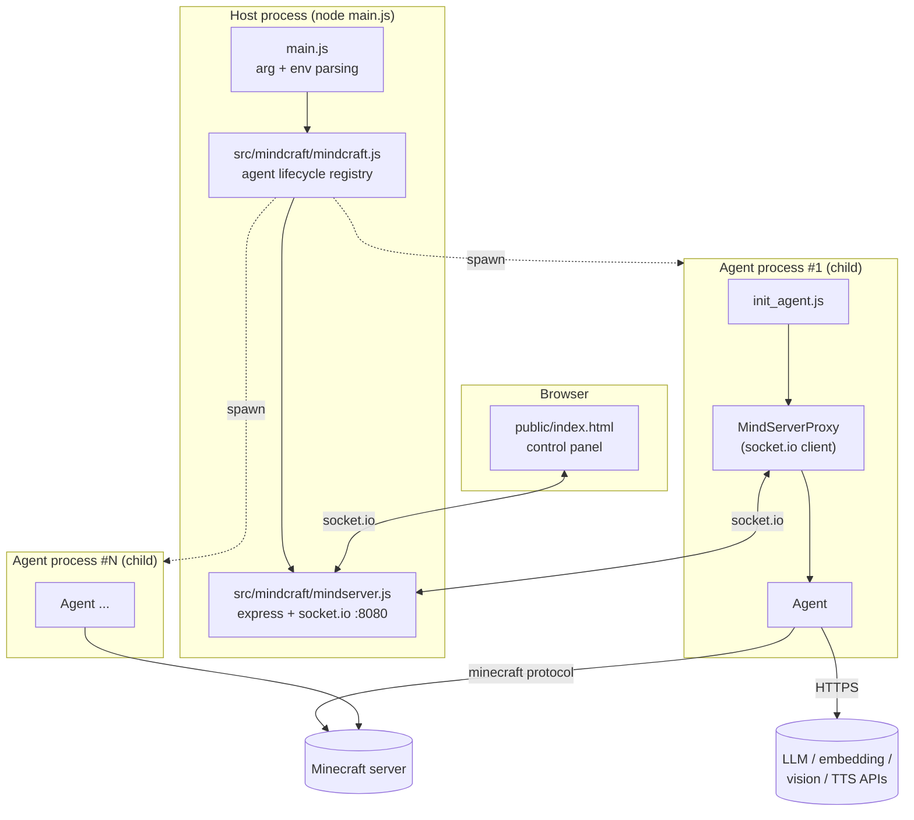
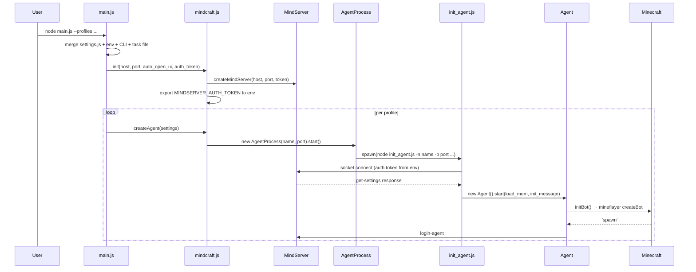
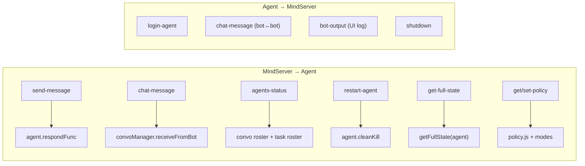
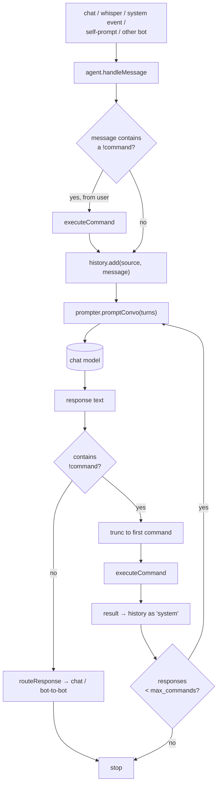
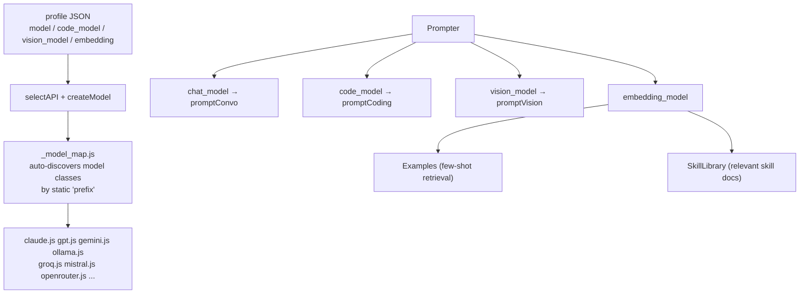
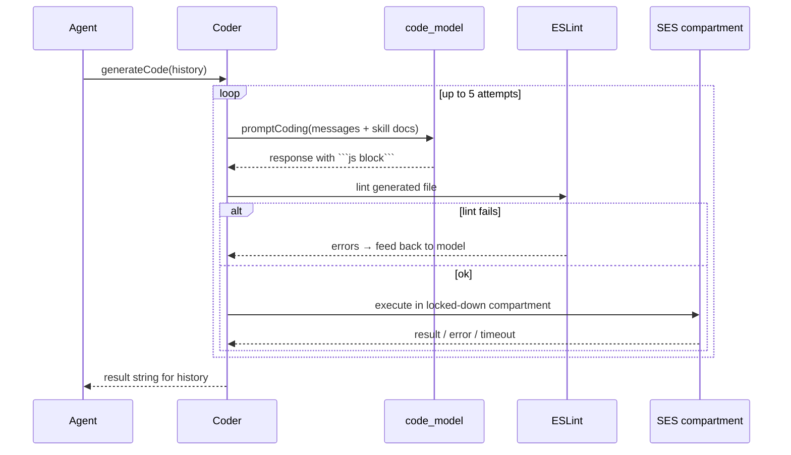
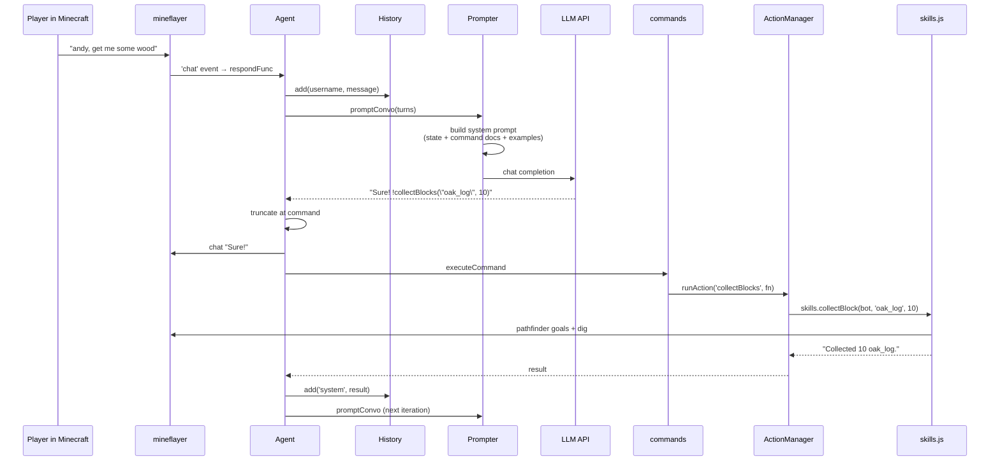

# Mindcraft Architecture

Mindcraft runs LLM-driven agents inside Minecraft. Each agent is an OS process
that connects to a Minecraft server with [mineflayer](https://github.com/PrismarineJS/mineflayer),
talks to an LLM provider, and reports back to a local control server (the
**MindServer**) that hosts the web UI.

The two organizing ideas:

1. **One agent = one child process.** Crashes, restarts, and blocking LLM calls
   are isolated per agent. Everything cross-agent goes over socket.io.
2. **The LLM only emits text.** Behavior comes from parsing `!command(args)`
   out of that text and running the corresponding JS. There is no tool-calling
   protocol dependency, so every provider works the same way.

---

## 1. Process & component map



**Why a separate MindServer at all:** the web UI needs a stable place to reach
agents that are constantly being killed and respawned. The MindServer owns the
socket registry; agent processes are disposable clients of it.

---

## 2. Startup sequence



Settings precedence, lowest to highest: `profiles/defaults/_default.json` →
base profile (`survival` / `assistant` / `creative` / `god_mode`) → the agent's
own profile JSON → `settings.js` → environment variables → CLI flags.

The child process never reads `settings.js` itself. It asks the MindServer for
its settings over the socket (`get-settings`) and installs them into the
mutable singleton `src/agent/settings.js`. That is why the auth token has to
travel in the environment: it is needed *before* settings can be fetched.

---

## 3. Component reference

### 3.1 Host layer — `main.js`, `src/mindcraft/`

| File | Responsibility |
|---|---|
| `main.js` | CLI/env parsing, task-file loading, calls `Mindcraft.init` then `createAgent` per profile. |
| `mindcraft/mindcraft.js` | The agent registry. `createAgent` / `startAgent` / `stopAgent` / `destroyAgent` / `shutdown`. Holds `agent_processes[name]`. |
| `mindcraft/mindserver.js` | Express static server for the UI, socket.io hub, item-texture endpoint `/assets/item/:agent/:name.png`, connection auth. |
| `mindcraft/mcserver.js` | LAN scan / ping helper for discovering Minecraft servers. |
| `process/agent_process.js` | `spawn`s `init_agent.js`, inherits stdio, auto-restarts on non-clean exit with a 10 s flap guard, calls `logoutAgent` on exit. |
| `process/init_agent.js` | Child entry point: parse argv, connect the proxy, construct and start the `Agent`. |

**Security boundary.** `mindserver.js` refuses to bind a non-loopback host
without `mindserver_auth_token`, because every control operation — create
agent, send message, shutdown — is exposed on that socket. When a token is set,
an `io.use` middleware rejects handshakes whose `auth.token` does not match.
The browser passes it as `?token=...`; agent children read
`process.env.MINDSERVER_AUTH_TOKEN`.

### 3.2 Transport — `src/agent/mindserver_proxy.js`

A singleton socket.io client, one per agent process. It is the entire
inbound/outbound surface between an agent and everything else.



`get-full-state` and `get/set-policy` are socket.io **acknowledgement** calls —
the UI requests, the agent replies through the callback. Everything else is
fire-and-forget.

### 3.3 The Agent — `src/agent/agent.js`

The composition root inside a child process. It constructs and wires:

| Field | Class | Purpose |
|---|---|---|
| `prompter` | `Prompter` | Profile + all LLM clients, prompt assembly. |
| `history` | `History` | Conversation turns, summarization, disk persistence. |
| `actions` | `ActionManager` | Runs exactly one long-running action at a time. |
| `coder` | `Coder` | Generates and sandbox-executes JS for `!newAction`. |
| `memory_bank` | `MemoryBank` | Named coordinates (`!rememberHere`). |
| `self_prompter` | `SelfPrompter` | The autonomous goal loop. |
| `npc` | `NPCContoller` | Legacy scripted goal system (item/build goals). |
| `vision_interpreter` | `VisionInterpreter` | Headless render → vision model. |
| `bot.modes` | modes list | Reactive per-tick behaviors. |
| `task` | `Task` | Benchmark task setup and validation, when running one. |

It also owns the mineflayer event wiring in `startEvents()`: `health`,
`death`, `messagestr` (death detection — matched against *both* the agent name
and the logged-in account username), `idle` (resume interrupted action),
`end` / `kicked` (clean kill so the parent can restart).

### 3.4 Message → behavior pipeline

This is the core loop. `handleMessage(source, message)`:



Key properties:

- Each LLM turn may emit **one** command; the response is truncated at it. The
  loop then re-prompts with the command's result, so multi-step plans are a
  sequence of turns, not a batch.
- `max_commands` bounds the loop (`-1` = unlimited).
- Behavior-log lines accumulated by modes (`bot.modes.behavior_log`) are
  flushed into history as `system` messages so the model learns what its
  reflexes did while it was thinking.
- Output is translated on the way out and in via `utils/translator.js`, and
  optionally spoken via `speak.js`.

### 3.5 Commands — `src/agent/commands/`

`index.js` builds a `commandList` from `actions.js` (~50 world-affecting
commands) and `queries.js` (~10 read-only ones), plus a regex-based parser.

```
!goToPlayer("Andy", 3)
 └─ commandMap → { params, perform }
                     └─ actions.js wraps in agent.actions.runAction(...)
                          └─ library/skills.js → mineflayer + pathfinder
```

- **Actions** mutate the world and go through `ActionManager`, so they are
  interruptible and only one runs at a time.
- **Queries** are synchronous reads over `library/world.js` and return strings
  straight back into history.
- `blacklistCommands` / `settings.blocked_actions` remove commands from the
  documented list, which is how a profile restricts what the model can do.
- Command docs are generated from the same table and injected into the system
  prompt via the `$COMMAND_DOCS` placeholder — the list the model sees is
  always the list that exists.

### 3.6 ActionManager — `src/agent/action_manager.js`

Single-slot executor. `runAction(label, fn, {timeout, resume})`:

- stops any currently executing action (`bot.interrupt_code`, grace period
  `STOP_GRACE_MS`), then runs the new one;
- tracks a `generation` counter so a stale action finishing late cannot clobber
  the current one;
- remembers a *resumable* action so the `idle` event can restart it (this is
  how `!followPlayer` survives interruptions);
- reports timeouts and errors back as text for history.

### 3.7 Modes and policies — `src/agent/modes.js`, `src/agent/behavior/policy.js`

**Modes** are the reflex layer: a fixed list of behaviors ticked every
mineflayer tick, independent of the LLM.

| Mode | Interrupts | What it does |
|---|---|---|
| `self_preservation` | all | Escape lava/fire/drowning/falling blocks, eat at low health. |
| `unstuck` | all | Detect no-progress and break out. |
| `cowardice` / `self_defense` | all | Flee or fight nearby hostiles. |
| `hunting` | — | Attack passive mobs for food. |
| `item_collecting` | — | Pick up nearby drops. |
| `torch_placing` | — | Light dark areas while moving. |
| `elbow_room` | — | Move out of another entity's space. |
| `idle_staring` | — | Look around when doing nothing. |
| `cheat` | — | Creative-mode shortcuts, off by default. |

Modes declare `interrupts` and are paused/unpaused around actions so a reflex
doesn't fight a deliberate plan. `!setMode` toggles them at runtime.

**Policies** are a declarative, user-authored layer on top of modes: a list of
`{condition, action}` rules validated against the `CONDITIONS` and `ACTIONS`
tables in `policy.js`. Conditions must be fast and side-effect free
(`hostile_nearby`, `health_below`, `has_item`, `at_position`, `is_night`,
`is_idle`, …). A policy can be set by the model (`!policy`), edited in the web
UI (`set-policy`), and persists per agent on disk. Installing one calls
`modes.installPolicy(...)` so it is evaluated on the same tick loop.

### 3.8 Self-prompting — `src/agent/self_prompter.js`

A three-state machine (`STOPPED` / `ACTIVE` / `PAUSED`). When a goal is set
(`!goal`), `startLoop()` repeatedly feeds the goal back in as a `system`
message, letting the agent act without human input. Incoming user messages
pause it; `!endGoal` and `!stop` stop it. `!stfu` silences chatting without
stopping the work.

### 3.9 Prompting and models — `src/models/`



`_model_map.js` scans its own directory at import time and registers any
exported class with a static `prefix`. **Adding a provider means adding one
file** that exports a class with a `prefix` and `sendRequest` — no registry
edit.

`Prompter` assembles the system prompt by substituting placeholders (stats,
inventory, nearby blocks, `$COMMAND_DOCS`, `$CODE_DOCS`, memory, examples).
Two retrieval systems feed it, both embedding-based with cosine similarity:

- `utils/examples.js` — picks the `num_examples` most similar few-shot
  conversations for the current message.
- `library/skill_library.js` — picks the `relevant_docs_count` most relevant
  skill function docs for code generation, plus a few always-shown ones.

If no embedding model is available both fall back to word-overlap scoring.

### 3.10 Code generation — `src/agent/coder.js` + `library/`

`!newAction` is the escape hatch: the model writes JavaScript instead of
picking a command.



- `library/lockdown.js` (SES) hardens globals; generated code runs in a
  `Compartment` with a curated surface, not raw `eval`.
- `settings.allow_insecure_coding` gates this whole feature; when off,
  `!newAction` is unavailable.
- The generated code is written to `bots/<name>/action-code/` for inspection.
- `library/skills.js` (~57 functions) and `library/world.js` (~24 functions)
  are the API surface the generated code is expected to call — they are also
  what the command implementations call, so there is one behavior layer, not
  two.

### 3.11 Inter-agent conversation — `src/agent/conversation.js`

A module-level `convoManager` per process, tracking one `Conversation` object
per peer agent. Bot-to-bot messages do **not** go through Minecraft chat; they
are relayed `agent → MindServerProxy → MindServer → peer proxy → peer agent`.
Each conversation has a queue, a start/end handshake (`!startConversation` /
`!endConversation`), and blocking so two bots don't talk over each other. The
roster comes from the periodic `agents-status` broadcast.

### 3.12 Vision — `src/agent/vision/`

`camera.js` renders the world headlessly with `prismarine-viewer` +
`node-canvas-webgl` + `three`, writes a PNG to `bots/<name>/screenshots/`, and
`vision_interpreter.js` sends it to the vision model. `!lookAtPlayer` and
`!lookAtPosition` drive it. `browser_viewer.js` additionally exposes a live
first-person view on a per-agent port, which the web UI links to.

### 3.13 Minecraft data — `src/utils/mcdata.js`, `mod_data.js`

`initBot()` lives here: it creates the mineflayer bot and installs the
pathfinder, pvp, collectblock, auto-eat and armor-manager plugins. The file
also carries the compatibility layer for modded servers — recovering unknown
window types by title, tolerating wider-than-vanilla chunk palettes, and
rolling up packet-decode errors instead of spamming. `mod_data.js` loads
datapacks dumped by `tools/mod-data-dumper` (a Java mod) so the agent knows
about modded items and recipes.

### 3.14 Web UI — `src/mindcraft/public/index.html`

Single static page, socket.io client. It lists agents from `agents-status`,
streams `bot-output`, sends `send-message` / `create-agent` / `restart-agent` /
`stop-agent` / `destroy-agent` / `shutdown`, pulls full state on demand via
`get-full-state`, and edits policies via `get-policy` / `set-policy`.
`settings_spec.json` describes the settings form, including which fields are
required and their defaults — the server validates `create-agent` payloads
against the same file.

### 3.15 Tasks & evaluation — `src/agent/tasks/`, `tasks/`

`Task` wraps a benchmark scenario: initial inventory, goal, agent count, and a
validator. `construction_tasks.js` validates a build against a blueprint;
`cooking_tasks.js` sets up multi-agent cooking scenarios. The top-level
`tasks/` directory holds Python analysis and evaluation harnesses that run
these at scale.

### 3.16 Python bindings — `src/mindcraft-py/`

`mindcraft.py` starts `init-mindcraft.js` as a subprocess and drives it
(`init`, `create_agent`, `shutdown`, `wait`), so Mindcraft can be embedded in a
Python experiment loop without touching Node.

---

## 4. Data flow: one user message, end to end



---

## 5. Persistence

Everything an agent writes lands under `bots/<agent_name>/`:

```
bots/<name>/
  last_profile.json     resolved profile after merging defaults
  memory.json           history summary + memory bank + self-prompt state
  histories/*.json      full timestamped conversation logs
  action-code/*.js      generated !newAction code
  screenshots/*.png     vision captures
  policy.json           saved behavior policy
```

`--load_memory` on restart restores `memory.json`, which is what makes an
agent's identity survive a crash-restart.

---

## 6. Extension points

| To add… | Do this |
|---|---|
| A new LLM provider | Add `src/models/<name>.js` exporting a class with a static `prefix` and `sendRequest`. Auto-registered. |
| A new command | Add an entry to `actionsList` in `commands/actions.js` (or `queries.js`). Docs and the system prompt update themselves. |
| A new low-level ability | Add a documented function to `library/skills.js`; it becomes available to both commands and generated code. |
| A new reflex | Add an entry to `modes_list` in `modes.js`. |
| A new policy condition/action | Add to `CONDITIONS` / `ACTIONS` in `behavior/policy.js`; validation and the UI follow. |
| A new agent personality | Add a profile JSON under `profiles/`. |
| A new benchmark | Add a task type under `src/agent/tasks/` plus a JSON task file. |

---

## 7. Failure handling

| Failure | Response |
|---|---|
| Minecraft disconnect / kick | `connection_handler.js` classifies the reason; `agent.cleanKill()` exits with code 1; `AgentProcess` restarts unless it flapped within 10 s. |
| MindServer disconnect | Proxy kills the agent process — an agent with no control channel is not useful. |
| LLM error / rate limit | `Prompter` cooldown + retry; the error text goes into history so the model can react. |
| Generated code error / infinite loop | Caught by the compartment, bounded by `code_timeout_mins`, error fed back for up to 5 repair attempts. |
| Action timeout | `ActionManager` cancels and reports; the generation counter prevents a late finish from corrupting state. |
| Modded server protocol surprises | `mcdata.js` recovery paths (window-by-title, wide palettes, packet-error rollup). |
```
